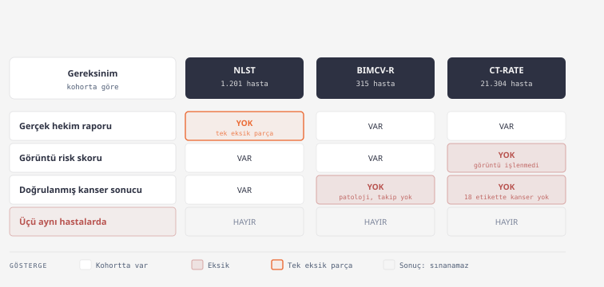
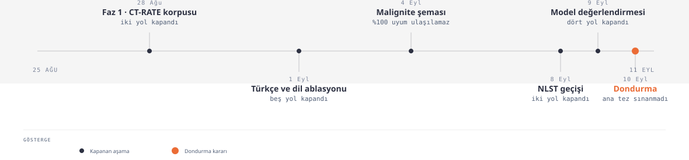
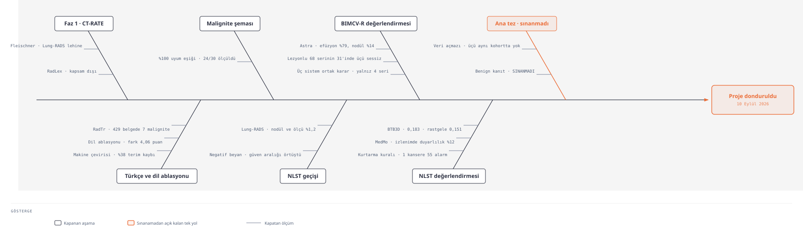

# CT-Report-VLM

Toraks BT radyoloji raporlarından yapılandırılmış bulgu çıkarımı ve görüntü-dil
modellerinin klinik doğruluk değerlendirmesi.

**Durum: proje dondurulmuştur (2026-09-10).** Araştırma kodu ve temel test
altyapısı korunmuştur. Tam sonuçların yeniden üretimi, depoya dahil edilmeyen
lisanslı veriler ve model çıktıları gerektirir.

> **Klinik kullanım hükmü.** Bu depoda geliştirilen hiçbir model, şema, sözlük
> veya çıkarım çıktısı klinik kullanım için doğrulanmamıştır. Buradaki sayılar
> araştırma amaçlı ölçümlerdir; tanı, tarama, triyaj veya karar desteği amacıyla
> kullanılamaz.

> **Yeniden üretilebilirlik sınırı.** Bu depo araştırma kodunu, testleri ve
> raporları içerir. Lisanslı ham veriler, model çıktıları ve kör değerlendirme
> anahtarları dahil değildir. Tam sonuç üretimi bu dış artefaktlar olmadan
> mümkün değildir. Model checkpoint kimliği bağımsız doğrulanamayan deneyler
> kendi raporlarında bu sınırla birlikte belirtilmiştir.

📄 **[DONDURMA_RAPORU.md](DONDURMA_RAPORU.md)** projenin giriş belgesidir: ne
soruldu, ne kuruldu, ne ölçüldü, hangi yollar denenip neden kapandı, dondurma
gerekçesi ve hangi koşullarda yeniden açılabileceği.

---

## Ne yapıldı

Proje, akciğer kanseri taramasında görüntü tabanlı risk modellerinin ürettiği
yanlış alarmları, radyoloji raporundan çıkarılan benign kanıtla azaltmayı
hedefledi.

Bunun için ham rapordan malignite değerlendirmesine uzanan bir çıkarım hattı
kuruldu ve üç kohortta beş sistem değerlendirildi. Ana hipotezi doğrudan sınamak
için gereken veri bileşiminin (aynı hastalarda hekim raporu, risk skoru ve
doğrulanmış kanser sonucu) hiçbir kohortta bulunmadığı anlaşıldı ve proje
donduruldu.

---

## Kurulan hat

Kapanışta kullanılan ana katmanların sürümleri aşağıda kaydedilmiştir.

| Katman | Sürüm | Kaynak |
|---|---|---|
| Cümle bölütleme | `seg-1.1` | `scripts/04_segment_sentences.py` |
| Şablon karakterizasyonu | `tmpl-1.0` | `scripts/05_template_stats.py` |
| Ölçü çıkarımı | `meas-1.2` | `scripts/07_extract_measurements.py` |
| Varlık ve ilişki çıkarımı | `ent-1.1` / `rel-1.0` | `src/radyovlm/extraction/entities.py` |
| Bağlam çözümleme | `ctx-1.1` | `src/radyovlm/extraction/context.py` |
| Çıkarım şeması | `sema-1.3` | `configs/extraction_schema.json` |
| Malignite değerlendirme şeması | `sema-1.0` | `configs/degerlendirme_semasi.json` |
| Türkçe yüzey sözlüğü | `tr-1.1` | `configs/turkce_yuzeyler_taslak.yaml` ve `src/radyovlm/extraction/turkce_varliklar.py` |
| Model çıktısı adaptörü | `astra-adaptor-1.2` | `src/radyovlm/extraction/astra.py` |
| Hasta düzeyi bölünme | `astra-split-1.0` | `configs/splits_astra.json` |

İki şemanın adı benzerdir ancak farklı nesnelerdir: `sema-1.3` **çıkarım**
şeması, `sema-1.0` **malignite değerlendirme** şemasıdır.

Son tam doğrulamada (2026-09-10) **508 test geçti.** Açık teknik borçlar
[DONDURMA_RAPORU.md](DONDURMA_RAPORU.md) Ek A'da listelidir.

---

## Ölçülenler

Üç rapor üreten sistem (Astra, MedMo, BTB3D) ve iki sürekli risk modeli
(Sybil, Pillar) üç kohortta değerlendirildi. Ölçümde metin benzerliği değil,
olumsuzlamaya duyarlı ve şans düzeltmeli bulgu düzeyi uyum kullanıldı.

| Kohort | Büyüklük | Referansın niteliği | Rapor |
|---|---|---|---|
| NLST | 2.965 seri | Takipte kanser sonucu. Tarama anındaki görünür lezyonun görüntü altını değildir | [btb3d_nlst](reports/btb3d_nlst_degerlendirme_raporu.md) · [astra_medmo](reports/nlst_astra_medmo_kapsamli_degerlendirme_raporu.md) |
| BIMCV-R | 317 seri | Hekim raporu. Patoloji veya takip sonucu yoktur | [bimcv_317](reports/bimcv_317_degerlendirme_raporu.md) |
| CT-RATE | 500 seri | Hekim raporu. Bağımsız görüntü temelli altın standart değildir | [btb3d_ctrate](reports/btb3d_ctrate_degerlendirme_raporu.md) |

Çıkarım hattının hekim raporlarındaki doğruluğu ayrıca ölçüldü (macro-F1 0,885)
ve seçilmiş alt kümelerde bağımsız kör değerlendirme yapıldı. Bu kontroller
sonuçların yönünü desteklemekle birlikte, özellikle Astra çıktılarındaki ölçüm
belirsizliğini tamamen ortadan kaldırmaz.

---

## Denenen yollar

Karar defterine kayıtlı eleme penceresi 25 Ağustos ile 10 Eylül 2026 arasıdır. Beş
aşamada on dört yol ölçümle kapandı: Faz 1 ve CT-RATE korpusunda iki, Türkçe ve dil
ablasyonunda beş, malignite şemasında bir, NLST geçişinde iki, model değerlendirmesinde
dört. Bir yol sınanamadan açık kaldı ve dondurma kararı onun içindir.

Her yolu kapatan ölçümün tek tek dökümü ve kapanma gerekçelerinin anlatısı
[DONDURMA_RAPORU.md](DONDURMA_RAPORU.md) bölüm 2 ve 5'tedir; görsel özeti aşağıdaki
diyagramlar bölümündedir.

---

## Diyagramlar

Dört devir diyagramı. Kaynakları ve tam boyutlu sürümleri `docs/diagrams/` altındadır.

### Metin işleme hattı

Ham raporun değerlendirmeye hazır yapılandırılmış çıktıya dönüşene kadar geçtiği
katmanlar. Hekim raporu ve model üretimi rapor iki ayrı giriş noktasından girer;
sözlükler ve çıkarım şeması hatta yandan bağlanır.


### Veri açmazı

Ana hipotezi doğrudan sınamak için aynı hastalarda bulunması gereken üç şey ve hiçbir
kohortun bunları bir arada sağlayamaması.



### Karar aşamaları

Beş aşamanın zaman içindeki sırası ve her aşamada kaç yolun kapandığı.



### Denenen yollar ve kapanma ölçümleri

Her dal bir yaklaşım, her alt dal onu kapatan ölçüm. Sağ uçtaki dal kapanmadı:
sınanamadan açık kaldı ve projenin ana tezidir. Geniş çizimdir, büyütmek için tıklayın.



---

## Kurulum

Aşağıdaki komutlar yalnız temel CT-RATE metin hattını kurar. NLST, BIMCV-R ve
model karşılaştırmalarının yeniden üretimi için ayrıca erişim kısıtlı veriler ve
model çıktıları gerekir.

```powershell
py -3.11 -m venv .venv
.\.venv\Scripts\python.exe -m pip install -r requirements.txt
```

Dondurma ortamının tam sürüm listesi `requirements-lock.txt` içindedir
(`pip freeze`, 2026-09-10). `requirements.txt` yalnız alt sınır belirtir; birebir
aynı ortamı kurmak için lock dosyasını kullanın:

```powershell
.\.venv\Scripts\python.exe -m pip install -r requirements-lock.txt
```

```powershell
# Ham CSV'den çalışma düzeyi korpusa
.\.venv\Scripts\python.exe scripts\01_build_report_corpus.py

# Cümlelere bölme (karakter ofsetleriyle), tam korpusta yaklaşık 11 dakika
.\.venv\Scripts\python.exe scripts\04_segment_sentences.py

# Doğrulama
.\.venv\Scripts\python.exe -m pytest tests\ -q
```

Test edilen sürüm Python 3.11.9. Çeviri deneyleri için ek bağımlılıklar
`requirements-ceviri.txt` içindedir.

### İnceleme araçları

```powershell
# Korpusun genel tablosu: demografi, etiket prevalansı, şablon yükü
.\.venv\Scripts\python.exe scripts\02_inspect_corpus.py

# Tek raporu oku, cümlelerini ofsetleriyle gör
.\.venv\Scripts\python.exe scripts\02_inspect_corpus.py --report 7
.\.venv\Scripts\python.exe scripts\02_inspect_corpus.py --sents 7

# Kelime arama
.\.venv\Scripts\python.exe scripts\02_inspect_corpus.py --search spicul
```

---

## Veri

**Lisanslı ve hasta veya seri tanımlayıcısı taşıyan veriler sürüm kontrolüne
dahil edilmez.** `.gitignore` bu dosyaları kapsar.

| Veri | Depoda | Erişim | Beklenen yer | Kullanım |
|---|---|---|---|---|
| CT-RATE | Hayır | Hugging Face erişim onayı | `data/raw/ct_rate/` | Metin hattı, korpus kurulumu |
| NLST | Hayır | Kontrollü erişim (CDAS) | Yerel, belgelenmeli | Kanser sonucuna karşı değerlendirme |
| BIMCV-R | Hayır | Kaynak koşulları | Yerel, belgelenmeli | Rapor uyumu değerlendirmesi |
| Astra, MedMo, BTB3D çıktıları | Hayır | Yerel artefakt ve Hugging Face | Yerel, belgelenmeli | Model karşılaştırmaları |

Betiklerin beklediği gerçek dosya adları ve bir veri manifesti henüz
yazılmamıştır; bu açık bir teknik borçtur ve
[DONDURMA_RAPORU.md](DONDURMA_RAPORU.md) bölüm 10'da kayıtlıdır.

### CT-RATE erişimi

CT-RATE `CC-BY-NC-SA-4.0` lisanslıdır ve ticari kullanıma kapalıdır. Kohort:
kontrastsız toraks BT, 25.692 çalışma ve 21.304 hasta, eşleşen radyoloji
raporları ve 18 anormallik etiketi.

1. [huggingface.co/datasets/ibrahimhamamci/CT-RATE](https://huggingface.co/datasets/ibrahimhamamci/CT-RATE) üzerinden erişim al
2. Şu dosyaları `data/raw/ct_rate/` altına indir:
   - `dataset/radiology_text_reports/{train,validation}_reports.csv`
   - `dataset/multi_abnormality_labels/{train,valid}_predicted_labels.csv`
   - `dataset/metadata/{train,validation}_metadata.csv`
   - `dataset/metadata/no_chest_{train,valid}.txt`

⚠ CT-RATE'in 18 anormallik etiketi arasında malignite, kanser, kitle veya tümör
bulunmamaktadır ve bu etiketler raporlardan otomatik üretilmiştir, radyolog
onaylı değildir. Bu nedenle rapordan çıkarılan sınıflar `report_derived_*` ön
ekiyle adlandırılır.

---

## Depo yapısı

```
DONDURMA_RAPORU.md    kapanış raporu, giriş noktası

src/radyovlm/
  extraction/         varlık, bağlam, şema, Türkçe matcher, model adaptörü
  evaluation/         puanlama, malignite şeması, envanter, çeviri, VLM koşumu

scripts/              numaralı betikler, korpus kurulumundan değerlendirmeye
                      (78 dosya depoda; numaralandırma 01 ile 83 arası)
configs/              şemalar, sözlükler ve dondurulmuş kilitler
tests/                508 gerileme testi
docs/                 çalışma planları, gerekçeler, karar defteri
  diagrams/           devir diyagramları (bağımsız HTML ve SVG)
reports/              ölçüm sonuçları ve değerlendirme raporları
outputs/              deney artefaktları, kör paketler
tools/                yardımcı araçlar

data/                 lisanslı veri (depoya dahil değil)
```

---

## Okuma sırası

| Belge | İçerik |
|---|---|
| **[DONDURMA_RAPORU.md](DONDURMA_RAPORU.md)** | Kapanış, gerekçeler, yeniden açma koşulları |
| [reports/faz1_veri_hazirligi_raporu.md](reports/faz1_veri_hazirligi_raporu.md) | Korpus kurulumu, şablon yapısı, ölçü çıkarımı |
| [reports/cikarim_dogruluk_raporu.md](reports/cikarim_dogruluk_raporu.md) | Çıkarım hattının mühürlü test kümesindeki doğruluğu |
| [docs/kararlar.md](docs/kararlar.md) | Karar defteri, koddaki `D<n>` atıflarının ölçülmüş gerekçeleri |
| [docs/40_sema_dondurma_protokol_degisikligi.md](docs/40_sema_dondurma_protokol_degisikligi.md) | Değerlendirme şemasının dondurulma gerekçesi |
| [reports/vlm14_sonuc_raporu.md](reports/vlm14_sonuc_raporu.md) | Metin katmanının 2.965 rapora uygulanması |
| [reports/vlm12_sonuc_raporu.md](reports/vlm12_sonuc_raporu.md) | Hasta düzeyinde bölünme dondurması |

---

## Yöntem ilkeleri

Veriyle sınanabilen kararlar ölçülmüş, veriyle belirlenemeyen klinik tercihler
mühendislik varsayımı olarak açıkça işaretlenmiştir. Kabul ölçütlerindeki
değişiklikler sürümlenmiş ve protokol değişikliği olarak kaydedilmiş; sayısal
sonuçlar sonradan yeniden adlandırılmamıştır.

- **Bölme hasta düzeyinde yapılır.** Aynı çalışmanın farklı rekonstrüksiyonları
  birebir aynı raporu taşır; hacim düzeyinde bölmek aynı raporu hem eğitime hem
  teste düşürür.
- **Her cümle ve ölçü, kaynak metindeki karakter ofsetini taşır.** Bu
  izlenebilirlik, model çıktısının rapora dayanıp dayanmadığını denetlemek için
  gereklidir.
- **Negasyon, şablon ve malignite ilgisi üç ayrı eksendir.** Olumsuzlanmış bir
  bulgu otomatik olarak malignite aleyhine kanıt değildir.
- **Şablon istatistiği yalnızca eğitim kümesinde hesaplanır**, doğrulama
  kümesinden ön işlemeye bilgi sızmaması için.
- **Kabul ölçütleri sonuç görülmeden yazılır**, sınav takımları kurallardan önce
  kilitlenir ve kör paketler SHA-256 ile mühürlenir.
- **Bir test kusur ortaya çıkardığında susturulmaz**, ölçülmüş bir sınıra
  çevrilip belgelenir.

Ayrıntılı gerekçeler: [docs/01_veri_notlari.md](docs/01_veri_notlari.md) ve
[docs/03_standartlastirma_plani.md](docs/03_standartlastirma_plani.md)

---

## Arşiv: dil ablasyonu (kapandı)

Türkçe ile İngilizce dil ablasyonu mevcut kanıt düzeyinde kapatıldı. Dil
seçiminin kendisinden çok çeviri yönteminin belirleyici olduğu görüldü. RadTr
test belgeleri skorlanmadı; ancak kaynak `train.json` dosyasında da
bulunduklarından bağımsız held-out değildir. Ayrıntılar:
[reports/task15_dondurma.md](reports/task15_dondurma.md) ve
[DONDURMA_RAPORU.md](DONDURMA_RAPORU.md) Ek C.

---

## Kaynaklar

**Veri ve modeller**

- Hamamci et al., *Developing Generalist Foundation Models from a Multimodal
  Dataset for 3D Computed Tomography*, arXiv:2403.17834 (CT-RATE)
- National Lung Screening Trial Research Team, *Reduced Lung-Cancer Mortality
  with Low-Dose Computed Tomographic Screening*, N Engl J Med 2011 (NLST)
- Mikhael et al., *Sybil: A Validated Deep Learning Model to Predict Future Lung
  Cancer Risk from a Single Low-Dose Chest Computed Tomography*, JCO 2023
- Delbrouck et al., *RadGraph-XL: A Large-Scale Expert-Annotated Dataset for
  Entity and Relation Extraction from Radiology Reports*, ACL Findings 2024

**Klinik kılavuzlar**

- American College of Radiology, *Lung CT Screening Reporting and Data System
  (Lung-RADS) v2022*
- MacMahon et al., *Guidelines for Management of Incidental Pulmonary Nodules
  Detected on CT Images: From the Fleischner Society 2017*, Radiology 2017

**Yöntem**

- Eyre et al., *Launching into clinical space with medspaCy*, AMIA 2021
- Chapman et al., *A simple algorithm for identifying negated findings and
  diseases in discharge summaries*, J Biomed Inform 2001 (NegEx)
