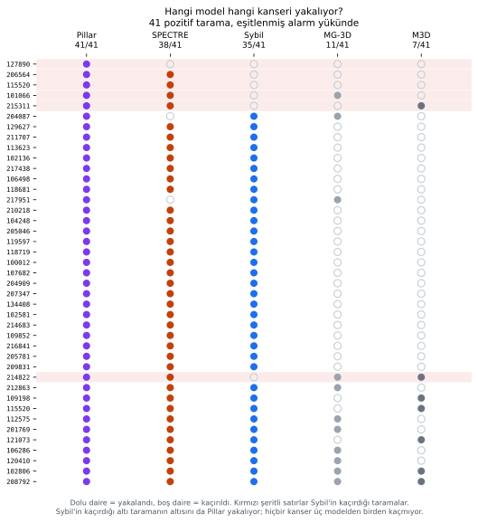
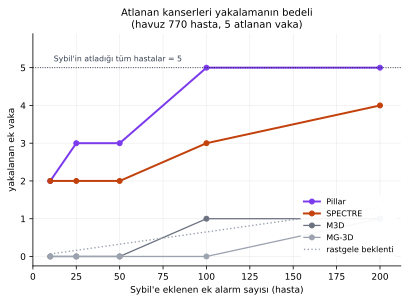

# NLST'de kaçan kanserler: Sybil, Pillar ve üç 3B BT temel modeli

Akciğer kanseri taramasında asıl maliyetli hata, kanserli bir taramaya alarm verilmemesidir.
Bu çalışma beş sistemi bu hata üzerinden karşılaştırır: hangi model hangi vakayı atlıyor, bir
modelin kaçırdığını bir diğeri yakalayabiliyor mu, ve kaçırılan bir kanseri yakalamak kaç ek
alarma mal oluyor.

NLST'nin bu iş için değeri, referans etiketin metin raporlarından türetilmiş dolaylı bir
etiket değil, takiple doğrulanmış gerçek kanser sonlanımı olmasıdır. Buna karşılık bu değerlendirme paketinde hekim
raporu ve lezyon anotasyonu bağlı değildir; ölçebildiğimiz şey "bu hastaya kanser tanısı kondu
mu", "model bu nodülü gördü mü" değil.

| Sistem | Ne yapar |
|---|---|
| **Sybil** | Tek BT'den 1-6 yıllık kanser riski tahmin eden yayımlanmış model. Karşılaştırma tabanı. |
| **Pillar** | Pillar-0 temel modelinin NLST'de ince ayarlanmış hâli, yani Sybil'in halefi (Sybil-1.5). |
| **SPECTRE-Large** | 3B BT hacmini vektöre çeviren genel amaçlı temel model. Kanser çıktısı yok; vektörün üstüne sınıflandırıcı eklendi. |
| **M3D-CLIP**, **MG-3D Swin-B** | Aynı türden iki temel model daha. |

---

## 1. Sonuç

- **Sybil 41 kanserli taramanın 6'sını kaçırıyor. Bu 6'sının 6'sını da Pillar yakalıyor.**
  İki modelin ortak yanlış negatifi yok. Hiçbir kanser üç modelden birden kaçmıyor.
- **Modellere eşit alarm bütçesi (675 tarama) tanındığında Pillar 41 vakanın 41'ini de
  yakalıyor**, SPECTRE 38, Sybil 35. Pillar'ın 1. yıl
  AUC'si `0,976`; farkı Sybil'e karşı `+0,062` (Holm p < 0,001), SPECTRE'ye karşı `+0,034`
  (Holm p = 0,002).
- **Kaçırılan bir kanseri yakalamanın maliyeti düşük görünüyor:** Sybil'e 10 ek alarm
  eklendiğinde Pillar ve SPECTRE, kaçırılan 5 hastanın 2'sini öne çıkarıyor. Rastgele seçimde
  beklenen 0,06.
- **Ama bu sayılarla karar verilemez.** Havuzda yalnız 5 kaçırılan hasta var; 5 vakalık bir
  havuzda tek bir vakanın yer değiştirmesi oranı 20 puan değiştirir.
- **SPECTRE'nin Sybil'e üstünlüğü gösterilemedi** (`+0,028`, Holm p = 0,32), üstelik
  karşılaştırma SPECTRE'nin lehine eşitsiz (bölüm 2).
- **M3D ve MG-3D ile yararlı bir kanser ayrımı gösterilemedi.** Bu kohortta ve kullanılan
  doğrusal sınıflandırıcıyla (linear probe), ikisi de şans düzeyinden ayrışmadı.
- **NLST hiçbir model için temiz bir dış doğrulama kümesi değil:** Sybil ve Pillar burada
  eğitildi, SPECTRE ön-eğitiminde gördü.

Bu hükümlerin hepsi bu kohorta ve bu ölçüm hattına özgüdür; hiçbiri klinik kullanım kararı
değildir.

---

## 2. Ne üzerinde, nasıl ölçtük

| | |
|---|---:|
| Kohort (`astra-split-1.0` filtresi sonrası) | **2.940 tarama / 1.198 hasta** |
| Birincil hedef: 1. yıl içinde kanser tanısı | **41 tarama / 40 hasta** |
| Hasta başına tarama | 3 tarama: 726 hasta · 2: 290 · 1: 182 |

Hedef, NLST'nin resmî `Kanser_Yil_1` ve `Mask_Yil_1` kolonlarından okundu. Neden 1. yıl:
kohortta 140 kanserli tarama var ama yalnız 41'inde tanı o taramanın yılında konmuş. Kalan
99'u 1. yıl sonlanımı değildir ve o taramada lezyonun görünür olup olmadığı bilinmemektedir;
tanı tarihi, önceki BT'de lezyonun görünmediğini göstermez. Bu yüzden onları 1. yıl hedefinde
"kaçırıldı" saymıyoruz. Gelecek yıllara ait ölçümler ekte.

Ölçüm birimi **tarama**dır, hasta değil: yayımlanmış Sybil ve Pillar sonuçları da tek bir BT
incelemesi üzerinden risk tahmini üretir. Hasta başına tek gözlem alan (her hastanın en erken taraması) ve hastanın
bütün taramalarının en yükseğini alan iki alternatif kurgu da hesaplandı; üçü de aynı sırayı
veriyor.

Sybil ve Pillar ham model çıktısıdır. Üç temel model sayı değil vektör ürettiği için,
vektörlerin üstüne lineer bir sınıflandırıcı eğitildi; model ağırlıkları donduruldu, çapraz
doğrulama hasta bazında gruplandı, aynı hastanın hiçbir taraması hem eğitim hem test tarafına
düşmedi.

> **Karşılaştırma eşit değil ve eşitsizlik temel modellerin lehine.** SPECTRE, M3D ve MG-3D'nin
> skoru bu kohortun kanser etiketleriyle eğitilmiş bir katmandan geliyor; Sybil ve Pillar
> burada hiçbir şey öğrenmedi. "SPECTRE ≈ Sybil" sonucu şöyle okunmalı: SPECTRE, bu kohortun
> etiketleriyle eğitilmiş bir yardımcı katmanla, donmuş Sybil'i ancak yakalıyor.

Güven aralıkları 2.000 kez hasta kümeli bootstrap ile hesaplandı, model farkları aynı bootstrap
örnekleminde eşleştirildi, çoklu karşılaştırmaya Holm düzeltmesi uygulandı.

---

## 3. Kim kaçırıyor?

1. yıl kanserini ayırma gücü:

| Model | AUC [%95 GA] |
|---|---:|
| **Pillar** | **0,976 [0,962; 0,988]** |
| SPECTRE-Large | 0,942 [0,905; 0,971] |
| Sybil | 0,914 [0,871; 0,952] |
| MG-3D Swin-B | 0,492 [0,395; 0,592] |
| M3D-CLIP | 0,410 [0,325; 0,492] |

| Eşleştirilmiş fark | ΔAUC [%95 GA] | Holm p | |
|---|---:|---:|---|
| Pillar − Sybil | +0,062 [+0,031; +0,099] | <0,001 | anlamlı |
| Pillar − SPECTRE | +0,034 [+0,009; +0,069] | 0,002 | anlamlı |
| SPECTRE − Sybil | +0,028 [−0,012; +0,075] | 0,324 | anlamlı değil |

Her modele Sybil'in 0,20 eşiğindeki alarm sayısı (675 tarama, kohortun %23'ü) kadar bütçe
verildiğinde:

| Model | Yakalanan | Kaçırılan | Yanlış alarm | PPV |
|---|---:|---:|---:|---:|
| **Pillar** | **41** | **0** | 634 | 0,061 |
| SPECTRE | 38 | 3 | 637 | 0,056 |
| Sybil | 35 | 6 | 640 | 0,052 |
| MG-3D | 11 | 30 | 664 | 0,016 |
| M3D | 7 | 34 | 668 | 0,010 |

Pozitif kestirim değerinin (PPV) bütün modellerde düşük çıkması beklenen bir sonuçtur; zira
kohorttaki kanser sıklığı yalnızca %1,4'tür (2.940 taramada 41 pozitif). Alarm verilenlerin
büyük çoğunluğunda o yıl kanser çıkmıyor.

**Yanlış negatiflerin örtüşmesi.** Sybil'in kaçırdığı 6 taramanın altısını da Pillar, beşini
SPECTRE yakalıyor. Sybil ile Pillar'ın ortak yanlış negatifi **sıfır**. Üç modelin birden
kaçırdığı kanser yok; 41 taramanın 41'ini en az bir model yakalıyor.

Bu, kâğıt üzerinde tamamlayıcılık için iyi bir zemin. İki uyarıyla:

Birincisi, bu 6 vakalık bir gözlem. Tek bir vakanın değişmesi tabloyu belirgin oynatır.

İkincisi, SPECTRE'nin yakaladığı 5 vaka sıralamada çok farklı yerlerde duruyor. SPECTRE
skorlarının %84'ü 0,01'in altında yığıldığı için, önceden belirlenmiş 675 alarmlık bütçenin
eşiği `0,0027`'ye iniyor; bu yüzden skorun mutlak değeri yerine sıralamadaki yeri daha
bilgilendirici:

| Hasta (tarama yılı) | Sybil | SPECTRE | SPECTRE sırası (2.940 içinde) |
|---|---:|---:|---:|
| 215311 (1999) | 0,150 | 0,971 | 19 |
| 214822 (1999) | 0,180 | 0,964 | 20 |
| 101066 (1999) | 0,119 | 0,042 | 310 |
| 115520 (1999) | 0,162 | 0,010 | 465 |
| 206564 (2000) | 0,132 | 0,004 | 601 |
| 127890 (1999) | 0,198 | 0,000008 | 1.687 |

SPECTRE 6 taramanın 5'ini bütçe içinde seçiyor; bunların ikisi sıralamada ilk 20'de, kalan
üçü 310., 465. ve 601. sırada. Son üçü bütçenin alt sınırına yakın seçildiği için daha küçük
bir bütçede listeden çıkardı; bu bir tespit başarısızlığı değil, alarm eşiğinin sınırında kalma
durumudur. Pillar'da altı taramanın da sıralamadaki yeri belirgin biçimde üstte.

Tablodaki tarama yılı önemli: 115520 numaralı hastanın iki pozitif taraması var ve Sybil
yalnız 1999 taramasını kaçırıyor. Aynı hastanın 2000 taramasında SPECTRE skoru `0,857`
(33. sıra), ama o taramayı Sybil de yakalıyor.

---

## 4. Kaçırılan kanserleri yakalamanın bedeli

Sybil'in 0,20 eşiğinde negatif bıraktığı havuz: 770 hasta, içinde 5 kaçırılan kanser (taban oran
%0,65). Bu havuzda Sybil'e ek alarm hakkı verildiğinde yakalanan ek vaka sayısı, parantezde
aynı bütçedeki ek yanlış alarm:

| Ek alarm | Rastgele beklenti | Pillar | SPECTRE | M3D | MG-3D |
|---:|---:|---:|---:|---:|---:|
| +10 | 0,06 | **2** (8 yanlış) | **2** (8) | 0 (10) | 0 (10) |
| +25 | 0,16 | **3** (22) | 2 (23) | 0 (25) | 0 (25) |
| +50 | 0,32 | **3** (47) | 2 (48) | 0 (50) | 0 (50) |
| +100 | 0,65 | **5** (95) | 3 (97) | 1 (99) | 0 (100) |
| +200 | 1,30 | **5** (195) | 4 (196) | 1 (199) | 1 (199) |

Pillar 10 ek alarmla kaçırılan 5 hastanın 2'sini, 100 ek alarmla hepsini öne çıkarıyor.
Rastgele seçimle 10 alarmda beklenen yakalama 0,06 olduğuna göre bu belirgin bir zenginleşme.

Maliyet-fayda dengesi şöyle okunmalıdır: tespit edilen her ek vaka başına eklenen yanlış alarm
sayısı +10 bütçede 4, +100 bütçede 19, +200 bütçede 39. Yani ilk iki vaka ucuza geliyor, kalan
üçünün bedeli giderek artıyor.

Sybil'in 0,20 eşiği önceki BIMCV analizinden devralınmıştır ve **klinik olarak doğrulanmış bir
eşik değildir**; burada yalnız modeller arasında eşit alarm yükü kurmak için ortak bir referans
noktası olarak kullanılıyor.

> **Karar verilemez.** Havuzda yalnız 5 kaçırılan hasta var; tek bir vakanın yer değiştirmesi
> oranı 20 puan değiştirir. Ne "tamamlayıcılık var" ne "yok" denebilir; yönelim umut verici,
> kanıt yetersiz. Bu soru daha büyük ve modellerin görmediği bir kümeye taşınmalı.

---

## 5. Sınırlar

**Az pozitif.** 41 pozitif tarama, Sybil'in kaçırdığı 5 hasta. Yanlış negatif ve tamamlayıcılık
analizlerinin istatistiksel gücü yok.

**Karşılaştırma eşit değil.** Üç temel model bu kohortun etiketleriyle eğitilmiş bir katman
kullanıyor, Sybil ve Pillar kullanmıyor (bölüm 2).

**Ölçüm bir geliştirme ölçümü.** Ana analiz 1.198 hastanın tamamı üzerinde çapraz doğrulamadır;
çapraz doğrulama katları ve karar eşikleri bu veriye bakılarak ayarlanabilir. Projenin dondurulmuş
`astra-split-1.0` bölünmesiyle ayrıca kontrol edildi ve sıralama değişmedi (Pillar 6/6,
SPECTRE 5/6, Sybil 5/6 held-out'ta). Ama held-out'ta 1. yıl pozitifi yalnız 6 taramadır;
kusursuz 6/6 sonuçta bile Wilson %95 alt sınırı %61,0'dir. Bu küme hiçbir eşiği sınayamaz ve
kohortun etiketleri daha önce görüldüğü için bağımsız doğrulama sayılmaz.

**Ön-eğitim maruziyeti.** Sybil NLST'de eğitildi, Pillar aynı NLST eğitim bölünmesinde ince
ayarlandı, SPECTRE NLST'yi ön-eğitiminde gördü. Bizim 1.198 hastamızın hangi bölünmede olduğu
bilinmiyor; Sybil'in bölünme ataması yayımlanmamış. Bu soru kendi sonuçlarımızı yayımlanmış
değerlerle karşılaştırarak çözülemez, çünkü o değerler farklı büyüklükte ve farklı vaka
karışımına sahip ayrı bir kohortta ölçülmüştür.

**Pillar'ın üstünlüğü 1. yıl ufkuna dayanıyor.** 3. yılda nokta tahmin olarak SPECTRE önde
(`0,760` ve `0,724`), ama bu ufukta eşleştirilmiş test yapılmadı ve pozitif sayısı 24. Ayrıca
Pillar'ın altı yıllık skorları taramaların %89,7'sinde birebir aynıdır (Sybil'de %11,6); yani
Pillar'ın zaman ekseni yıllar arasında çeşitlilik göstermiyor, fiilen tek bir skordan
ibaret.

**Ölçülen şey sonlanım, lezyon değil.** "Model bu nodülü gördü mü" bu veriyle sorulamaz.

**Sonuçlar bu kohorta ve bu ölçüm hattına özgü.** İstatistiksel olarak anlamlı bir farkın
gösterilememiş olması, M3D ve MG-3D'nin hiçbir bilgi taşımadığını ya da başka görevlerde
etkisiz olduğunu kanıtlamaz.

---

## 6. Sonraki adımlar

1. **Tamamlayıcılık için daha büyük bir küme gerekiyor.** 5 kaçırılan vakayla hiçbir eşik ya da
   bütçe sınanamaz. Kanser etiketi olan ve modellerin görmediği bir kohort şart.
2. **Pillar'ın projede nerede kullanılabileceği gözden geçirilmeli.** Bu kohortta Sybil'in
   bütün kaçırdıklarını yakalıyor ve skoru projede zaten mevcut. Karar için diğer ufuklarda ve
   dış kümede değerlendirilmesi gerekir.
3. **SPECTRE'nin skorunun hacmin neresinden geldiği ölçülebilir.** NLST için yayımlanmış
   radyolog lezyon anotasyonları var ama bu değerlendirme paketine bağlanmadı. Bağlanırsa,
   SPECTRE'nin atıf haritasının lezyon kutusuyla örtüşme oranı hesaplanabilir. Bu, modelin
   lezyonu "gördüğünü" kanıtlamaz; yalnız skorun kaynağının lezyon konumuyla uyumlu olup
   olmadığını sınar.
4. **Pillar'ın yıllar arasında sabit kalan zaman ekseni incelenmeli.**

---

## Ek: yan bulgular

**Gelecek yıllar.** Sybil ve Pillar için her ufukta o ufkun kendi risk skoru (`y1…y6`) kullanıldı. SPECTRE'nin
sınıflandırıcısı yalnız 1. yıl etiketiyle eğitildiği için bütün ufuklarda aynı skorla yer
alıyor; bu yüzden ileri yıllarda SPECTRE dezavantajlı bir karşılaştırmadadır. Tarama başına
AUC:

| Ufuk | Pozitif | Sybil | Pillar | SPECTRE |
|---:|---:|---:|---:|---:|
| 1. yıl | 41 | 0,914 | **0,976** | 0,942 |
| 2. yıl | 19 | 0,786 | **0,794** | 0,777 |
| 3. yıl | 24 | 0,635 | 0,724 | **0,760** |
| 4. yıl | 22 | 0,609 | **0,688** | 0,668 |
| 5. yıl | 23 | 0,597 | **0,697** | 0,684 |
| 6. yıl | 11 | 0,639 | **0,756** | 0,679 |

Birleşik 2-6. yıl penceresinde (99 pozitif / 1.887 tarama): Sybil `0,659`, Pillar `0,736`,
SPECTRE `0,721`. Pozitif sayıları küçük, bu tablo betimseldir.

**Yanlış alarmların bir kısmı ileride kansere dönüyor.** Eşit alarm yükünde, her model kendi
alarm verdiği ve vermediği gruplarla karşılaştırıldığında, alarm verilenlerde 2-6. yıl kanser
oranı Pillar'da kendi taban grubunun `5,07` katı, SPECTRE'de `5,01`, Sybil'de `2,50`, M3D'de
`1,05`, MG-3D'de `0,80`. Keşifseldir ve ileride kanser tanısı almak, ilk alarmın doğru bir
bulguya dayandığını lezyon kanıtı olmadan göstermez.

**M3D ve MG-3D'de neden ayrım çıkmadı.** Kayıt tekniğinden kaynaklanabilecek karıştırıcı
etkenler incelendi: kesit sayısı, kesit kalınlığı ve piksel boyutunun tek başına 1. yıl AUC'si şans
düzeyinde (`0,487`, `0,503`, `0,490`), üretici grubu sabit tutulduğunda da M3D düzelmiyor.
Üç model de kayıt tekniğini kodluyor ama en çok kodlayan SPECTRE ve kanserde en iyi olan da o.
Etiket permütasyonuyla ölçülen boş hipotez dağılımında M3D (1.000 tekrar, p = 0,234) ve
MG-3D (200 tekrar, p = 0,985) bu dağılımın sınırları içinde kalıyor; SPECTRE dışında kalıyor
(200 tekrar, Holm p = 0,030). Permütasyon testinde, M3D ve MG-3D'nin 0,50 altı AUC'leri için
ters yön kanıtı bulunmadı; değerler boş hipotezle uyumlu.

Not: permütasyon testi tek kat bölünmesiyle koşuldu ve karşılaştırılan "ölçülen" değer de aynı
tek tohumlu hattan üretildi. Raporun geri kalanındaki AUC'ler beş tohum ortalamasıdır, bu yüzden
iki değer birebir aynı değildir (SPECTRE `0,935` ve `0,942`).

Bütün bunlar, bu kohortta ve bu sınıflandırıcıyla yararlı bir ayrım gösterilemediği anlamına
gelir; sıfır bilgi kanıtı değildir.

**Sybil ile SPECTRE'nin birleşimi.** Sıra ortalamasıyla kurulan parametresiz birleşim hasta
düzeyinde `0,928 [0,887; 0,963]`; Sybil'i geçiyor (`+0,047`, p = 0,001) ama SPECTRE'yi geçmiyor
(`+0,010`, p = 0,45). Pillar'ı içeren birleşimler denenmedi.

---

## Yeniden üretim

| Öğe | Konum |
|---|---|
| Ana değerlendirme | `scripts/88_vlm34_nlst_fpfn_degerlendirme.py` |
| Eşleştirilmiş farklar, karıştırıcı, permütasyon | `scripts/89_vlm34_nlst_eslestirilmis_ve_karistirici.py` |
| Şekiller | `scripts/90_vlm34_nlst_gorseller.py` |
| Sybil + SPECTRE birleşimi | `scripts/91_vlm34_nlst_birlesim.py` |
| Estimand, bölünme, gelecek yıllar, zenginleşme, Pillar farkları | `scripts/92_vlm34_nlst_denetim_duzeltmeleri.py` |
| Çıktılar ve tarama düzeyi skorlar | `outputs/vlm34/` |
| Kohort filtresi ve bölünme | `configs/splits_astra.json` (`astra-split-1.0`) |
| Sonlanım etiketleri | `astra_radiology_reports_with_labels_all.xlsx` |

| Model | Depo | HEAD |
|---|---|---|
| SPECTRE | `chn123/spectre-ctrate-bimcv-500-benchmarks` | `cf5c040` |
| M3D-CLIP | `chn123/m3d-ctrate-bimcv-500-benchmarks` | `5d6d49a` |
| MG-3D Swin-B | `chn123/mg3d-ctrate-bimcv-500-benchmarks` | `7c994e7` |

Üç pakette tarama sırası, kanser etiketi, `censor_time` ve Sybil/Pillar skorları birebir
aynıdır; `scripts/88` bunların hepsini `assert` ile doğrular.
